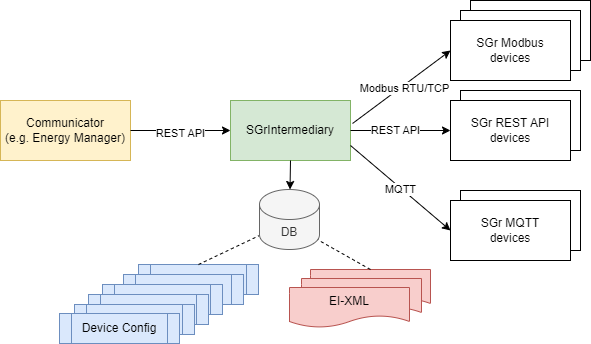

# SmartGridready (SGr) Java Intermediary

## Index

- [Introduction](#introduction)
- [Installation and Operation](#installation-and-operation)
- [API Documentation](#api-documentation)
- [Postman Collection](#postman-collection)
- [Examples](#examples)
- [Development](#development)

## Introduction

The Java-based _Intermediary_ application allows access to SmartGridready-compliant devices through a
REST API. Developers of SGr communicator applications such as energy-manager applications
can use the _Intermediary_ instead of integrating a SmartGridready commmunication handler library written
in Java or Python.

The _Intermediary_ acts as a bridge between the communicator application and the SmartGridready-compliant devices.

 

This solution is particularly useful for applications written in programming languages that do not have a
SmartGridready `commhandler` library available.

The _Intermediary_ allows standardized access to arbitrary SGr devices, described by EI-XML files.
The EI-XML describes details needed to communicate with the device's specific interface.

Adding a new device follows in two steps:

1. Add the device-specific EI-XML (that exists in the GitHub repository) if it does not already exist.
2. Add the device itself with an arbitrary device name, a reference to the EI-XML and the device specific configuration.

## Installation and Operation

The recommended installation method is to use the `sgr-intermediary` Docker image.

- Install Docker e.g. Docker desktop on your machine.
  - see [Docker Desktop Windows](https://docs.docker.com/desktop/install/windows-install/)
  - see [Docker Desktop Mac](https://docs.docker.com/desktop/install/mac-install/)
  - see [Docker Desktop Linux](https://docs.docker.com/desktop/install/linux/)

- Go to the shell/cmd terminal and pull the smartgridready/sgr-intermediary docker image from the github registry:
  - `docker pull ghcr.io/smartgridready/sgr-intermediary:master`

- Then run the Docker image:
  - `docker run -d -p 8080:8080 --name sgr-intermediary ghcr.io/smartgridready/sgr-intermediary:master`

- Check if the `sgr-intermediary` container is running:
  - `docker container ls -f name=sgr-intermediary`

See [examples](./examples/docker/README.md) for more information on how to use Docker to run the _Intermediary_.

## API Documentation

The REST API provides a management API for EI-XML files and devices. You can add, update and delete EI-XML and devices.
A documentation of the complete REST API is available as OpenAPI-based HTML documentation within the project sources.
See [OpenAPI Docs](./openapi/index.html)

If you have a running a Docker container or running the _Intermediary_ on your local machine you can open
the Swagger UI to get documentation test the API: [Swagger Docs](http://localhost:8080/swagger-ui.html)

## Postman Collection

Within the `<project-root>/postman` folder you find a Postman collection that contains
samples on on how to use the API described above.

See [Postman](https://www.postman.com/downloads/) to get it.

**Instructions**:

1. Make sure the _Intermediary_ is running on port 8080.
2. Open Postman.
3. Create a new workspace.
4. Import the _collection_. It provides a list of example API requests.
5. Duplicate a request and modify it according to your needs.
6. Execute the request.

## Examples

### Overview

You can add EI-XML from different repositories:

- From official SmartGridready declaration library: `http://localhost:8080/eiXml/sgr-library`
- From an arbitrary web resource/URI: `http://localhost:8080/eiXml/web-resource`
- From a local file: `http://localhost:8080/eiXml/local-file`

You can read (GET) and write (PUT) data of devices:

- `http://localhost:8080/value/<deviceName>/<functionalProfileName>/<dataPointName>`

### Adding an EI-XML for a WAGO smart meter from the official SGr declaration library

`HTTP POST:  http://localhost:8080/eiXml/sgr-library`

using the form-data as query parameters:

```text
eiXmlName=SGr_00_0014_0000_WAGO_SmartMeter_V0.3.xml
```

Example using _curl_:

```bash
curl -X POST http://localhost:8080/eiXml/sgr-library -F "eiXmlName=SGr_00_0014_0000_WAGO_SmartMeter_V0.3.xml"
```

Example using _PowerShell_ (tested with version 7.5):

```bash
Invoke-Webrequest -Uri "http://localhost:8080/eiXml/sgr-library" -Method POST -Form @{ eiXmlName = "SGr_00_0014_0000_WAGO_SmartMeter_V0.3.xml" }
```

### Adding an EI-XML from a custom URI

`HTTP POST:  http://localhost:8080/eiXml/web-resource`

using the form-data as query parameters:

```text
  eiXmlName=SGr_00_0014_0000_WAGO_SmartMeter_V0.3.xml
  uri=https://custom.host.name/<path-to-ei-xml>?param1=... 
```

Example using _curl_:

```bash
curl -X POST http://localhost:8080/eiXml/web-resource -F "eiXmlName=SGr_00_0014_0000_WAGO_SmartMeter_V0.3.xml" -F "uri=https://raw.githubusercontent.com/SmartGridready/SGrSpecifications/refs/heads/master/XMLInstances/ExtInterfaces/SGr_00_0014_0000_WAGO_SmartMeter_V0.3.xml"
```

Example using _PowerShell_ (tested with version 7.5):

```bash
Invoke-Webrequest -Uri "http://localhost:8080/eiXml/web-resource" -Method POST -Form @{ eiXmlName = "SGr_00_0014_0000_WAGO_SmartMeter_V0.3.xml"; uri = "https://raw.githubusercontent.com/SmartGridready/SGrSpecifications/refs/heads/master/XMLInstances/ExtInterfaces/SGr_00_0014_0000_WAGO_SmartMeter_V0.3.xml" }
```

### Adding an EI-XML from a local file

`HTTP POST:  http://localhost:8080/eiXml/local-file`

using the form-data body for multipart file upload:

```text
  file=<MultiPartFile>
```

Example using _curl_:

```bash
curl -X POST http://localhost:8080/eiXml/local-file -F "file=@path/to/your/eid.xml"
```

Example using _PowerShell_ (tested with version 7.5):

```bash
Invoke-Webrequest -Uri "http://localhost:8080/eiXml/local-file" -Method POST -ContentType "multipart/form-data" -Form @{ file = Get-Item -Path "C:\path\to\your\eid.xml" }
```

### Adding a first WAGO device

`HTTP POST: http://localhost:8080/device`

with the following JSON in the body:

```json
{
  "name": "WAGO-Smartmeter-1",
  "eiXmlName": "SGr_00_0014_0000_WAGO_SmartMeter_V0.3.xml",
  "configurationValues": [
    {
      "name": "serial_port",
      "val": "COM3"
    },
    {
      "name": "serial_baudrate",
      "val": 19200
    },
    {
      "name": "serial_databits",
      "val": 8
    },
    {
      "name": "serial_stopbits",
      "val": 1
    },
    {
      "name": "serial_parity",
      "val": "EVEN"
    },
    {
      "name": "slave_id",
      "val": 1
    }
  ]
}
```

### Adding a second WAGO device

`HTTP POST: http://localhost:8080/device`

with the following JSON in the body:

```json
{
  "name": "WAGO-Smartmeter-2",
  "eiXmlName": "SGr_00_0014_0000_WAGO_SmartMeter_V0.3.xml",
  "configurationValues": [
    {
      "name": "serial_port",
      "val": "COM3"
    },
    {
      "name": "serial_baudrate",
      "val": 19200
    },
    {
      "name": "serial_databits",
      "val": 8
    },
    {
      "name": "serial_stopbits",
      "val": 1
    },
    {
      "name": "serial_parity",
      "val": "EVEN"
    },
    {
      "name": "slave_id",
      "val": 2
    }
  ]
}
```

### Adding a dynamic tariff source

Example using _curl_:

```bash
curl -X POST http://localhost:8080/eiXml/sgr-library -F "eiXmlName=SGr_05_mmmm_dddd_Dynamic_Tariffs_GroupeE_V1.0.xml"
curl -X POST http://localhost:8080/device \
  -H 'Content-Type: application/json' \
  -d '{"name":"Groupe-Tariff","eiXmlName":"SGr_05_mmmm_dddd_Dynamic_Tariffs_GroupeE_V1.0.xml","configurationValues":[]}'
```

Example using _PowerShell_ (tested with version 7.5):

```bash
Invoke-Webrequest -Uri "http://localhost:8080/eiXml/sgr-library" -Method POST -Form @{ eiXmlName = "SGr_05_mmmm_dddd_Dynamic_Tariffs_GroupeE_V1.0.xml" }
Invoke-Webrequest -Uri "http://localhost:8080/device" -Method POST -ContentType "application/json" -Body '{"name":"Groupe-Tariff","eiXmlName":"SGr_05_mmmm_dddd_Dynamic_Tariffs_GroupeE_V1.0.xml","configurationValues":[]}'
```

### Reading a voltage from WAGO-Smartmeter-1

Request format:

`HTTP GET: http://localhost:8080/value/<deviceName>/<functionalProfileName>/<dataPointName>`

Example:

`HTTP GET: http://localhost:8080/value/WAGO-Smartmeter-1/VoltageAC/VoltageACL1_N`

Example using _curl_:

```bash
curl -X GET http://localhost:8080/value/WAGO-Smartmeter-1/VoltageAC/VoltageACL1_N
```

Example using _PowerShell_ (tested with version 7.5):

```bash
Invoke-Webrequest -Uri "http://localhost:8080/value/WAGO-Smartmeter-1/VoltageAC/VoltageACL1_N" -Method GET
```

The returned JSON value should look like this:

```json
234.0
```

### Reading dynamic tariff data

Reading dynamic tariff data requires the query parameters `start_timestamp` and `end_timestamp`
specified in each request.

Example using _curl_:

```bash
curl -X GET http://localhost:8080/value/Groupe-Tariff/DynamicTariff/TariffSupply \
  -F "start_timestamp=2025-01-01T00:00:00+01:00" -F "end_timestamp=2025-01-02T00:00:00+01:00"
```

Example using _PowerShell_ (tested with version 7.5):

```bash
Invoke-Webrequest -Uri "http://localhost:8080/value/Groupe-Tariff/DynamicTariff/TariffSupply" -Method GET -Form @{ start_timestamp = "2025-01-01T00:00:00+01:00"; end_timestamp = "2025-01-02T00:00:00+01:00" }
```

The returned JSON value should look like this:

```json
[
  {
    "start_timestamp": "2025-01-01T00:00:00+01:00",
    "end_timestamp": "2025-01-01T00:15:00+01:00",
    "integrated": [
      {
        "value": 10.88,
        "unit": "Rp./kWh"
      }
    ]
  },
  {
    "start_timestamp": "2025-01-01T00:15:00+01:00",
    "end_timestamp": "2025-01-01T00:30:00+01:00",
    "integrated": [
      {
        "value": 10.91,
        "unit": "Rp./kWh"
      }
    ]
  },
  ...
]
```

## Development

### Run in development mode

Navigate to the checked out repository and run

```bash
./mvnw spring-boot:run -D"spring-boot.run.profiles=dev"
```

This will run the Intermediary locally, using an in-memory database.

### Generate OpenAPI HTML

Navigate to the checked out repository and run

```bash
./generate-openapi-html.sh
```

This will build the Intermediary Docker image, start a container and use the openapi-generator Docker image to
generate HTML from the OpenAPI specification in `./openapi`.
