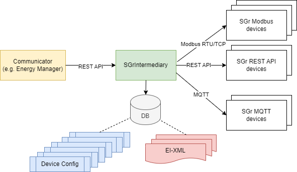

# SGrJavaIntermediary
## Introduction

The SGrJavaIntermediary application allows access to SmarGridready compliant devices through a
WEB-Service API. Developers of SGr communicator applications such as energy-manager applications
can use the SGrJavaIntermediary instead of integrating a SmartGridready commm-handler library written 
in Java or Python.

The SGrJavaIntermediary acts as a bridge between the communicator application and the SmartGridready
compliant devices.

 

This solution is particularly useful for applications written in programming languages that do not have an available 
SmartGridready commhandler library.

## Installation

Currently proposed installation variant is to use the SGrIntermediary docker image.

- Install docker e.g. Docker desktop on your machine. 
  - see [Docker desktop Windows](https://docs.docker.com/desktop/install/windows-install/)
  - see [Docker desktop Mac](https://docs.docker.com/desktop/install/mac-install/)
  - see [Docker desktop Linux](https://docs.docker.com/desktop/install/linux/)

- Go to the shell/cmd terminal and pull the smartgridready/sgr-intermediary docker image from the github registry:
  - `docker pull ghcr.io/smartgridready/sgr-intermediary:master`

- Then run the docker image:
  - `docker run -d -p 8080:8080 --name sgr-intermediary ghcr.io/smartgridready/sgr-intermediary:master`

- Check if the 'sgr-intermediary' container is running:
  - `docker container ls -f name=sgr-intermediary`

Now your SGrIntermediary is ready to be configured.

## Configuration

Configuration of the SGrIntermediary is done through the web-service API. 

For detailed API documentation see:  <a href="https://github.com/SmartGridready/SGrJavaIntermediary/tree/master/openapi/index.html" target="_blank">OpenAPI doc</a>

If you have a running SGrIntermediary container on your local machine you open the Swagger doc:  [Swagger doc](http://localhost:8080/swagger-ui.html)

The configuration follows in two steps:

1. Add alle external interface XML (EI-XML) using the `ExternalInterfaceXmlController` API required by your devices.

2. Add your devices using the `DeviceController` API. For each device you need to specify the according EI-XML using the 
EI-XML filename and the device configuration values such as ip-address/port of the device. The configuration values needed
by a device can be read in the EI-XML within the `<configurationList>` tag. 

 
